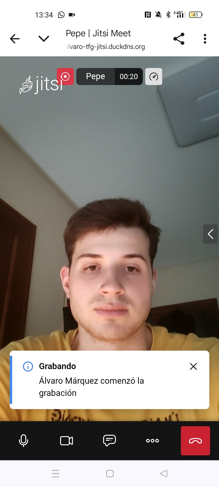
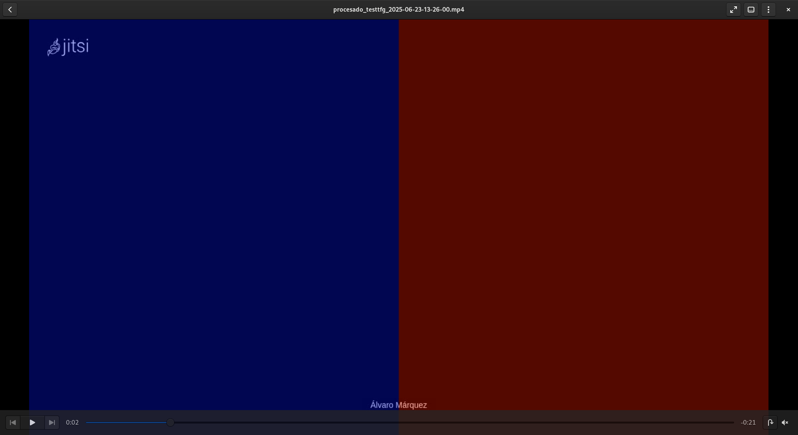

# TFG: Sistema de Procesamiento de Vídeo Distribuido con Jitsi, Kafka y Spark

Este repositorio contiene el código fuente y la configuración para el Trabajo de Fin de Grado en Ingeniería Informática de la Universidad de Burgos. El proyecto implementa un pipeline completo y automatizado para la captura, ingesta y procesamiento de vídeo distribuido. Despliegue y validación de un pipeline de datos de extremo a extremo para la captura y análisis de vídeo en un entorno orquestado por contenedores.

Autor: Álvaro Márquez Ques

Tutores: D. José Miguel Ramírez Sanz y D. José Luís Garrido Labrador

---

## Resumen
En el contexto tecnológico actual, la generación de datos de vídeo ha crecido de forma exponencial, creando la necesidad de desarrollar sistemas robustos, escalables y eficientes para su procesamiento. Este proyecto aborda dicho desafío mediante el diseño y la implementación de una infraestructura de software completa y de extremo a extremo, desde la captura del vídeo hasta su análisis.

El sistema utiliza Jitsi Meet como plataforma de videoconferencia y su componente Jibri para la grabación de las sesiones, generando los ficheros de vídeo fuente. Para la ingesta y el procesamiento, se ha desplegado un pipeline de datos que utiliza Apache Kafka como broker de mensajería en su modo moderno KRaft y un clúster de Apache Spark para la computación distribuida. Toda la arquitectura, compuesta por más de siete servicios independientes, se ha desplegado y orquestado mediante Docker y Docker Compose, garantizando la reproducibilidad y portabilidad del entorno.

El proyecto culmina con una prueba de concepto funcional que demuestra la viabilidad del pipeline: un vídeo grabado con Jitsi es consumido y procesado por un trabajo de Spark escrito en Python, que le aplica una transformación visual (un tinte de color de pantalla dividida) utilizando la librería OpenCV, validando así el flujo de datos completo.


## Abstract
In the current technological context, video data generation has grown exponentially, creating the need to develop robust, scalable, and efficient systems for its processing. This project addresses this challenge by designing and implementing a complete, end-to-end software infrastructure, from video capture to its analysis.

The system uses Jitsi Meet as a videoconferencing platform and its Jibri component for recording sessions, generating the source video files. For ingestion and processing, a data pipeline has been deployed using Apache Kafka as a messaging broker in its modern KRaft mode and an Apache Spark cluster for distributed computing. The entire architecture, comprising more than seven independent services, has been deployed and orchestrated using Docker and Docker Compose, ensuring the reproducibility and portability of the environment.

The project culminates in a functional proof of concept that demonstrates the pipeline's viability: a video recorded with Jitsi is consumed and processed by a Spark job written in Python, which applies a visual transformation (a split-screen color tint) using the OpenCV library, thus validating the entire data flow.

---

## Diagrama de Arquitectura General

<table>
  <tr>
    <td align="center">
      
    </td>
  </tr>
</table>

---

## 🚀 Tecnologías Utilizadas

* **Captura de Vídeo:** Jitsi Meet, Jibri
* **Contenerización y Orquestación:** Docker, Docker Compose
* **Pipeline de Datos:** Apache Kafka (en modo KRaft)
* **Procesamiento Distribuido:** Apache Spark
* **Lenguaje de Programación:** Python 3.12
* **Librerías Clave:** PySpark, OpenCV, NumPy
* **Infraestructura de Red:** Let's Encrypt (para certificados SSL), DuckDNS (para dominio público)
* **Sistema Operativo Anfitrión:** Debian 11 (Bullseye)

---

## 🛠️ Guía de Despliegue y Uso

Esta guía describe el proceso completo para desplegar y verificar el sistema desde una máquina anfitriona limpia.

### Fase 0: Requisitos Previos en el Sistema Anfitrión

Antes de empezar, el sistema anfitrión (host) debe cumplir los siguientes requisitos:

1.  **Sistema Operativo:** Debian 11 (o una distribución de Linux compatible).
2.  **Software Base Instalado:**
    ```bash
    sudo apt update && sudo apt install -y git curl docker.io docker-compose-v2
    ```
3.  **Módulo del Kernel para Jibri:** Este módulo es **crítico** para que Jibri pueda grabar vídeo correctamente.
    ```bash
    sudo apt install v4l2loopback-dkms
    ```
4.  **Configuración de Red (para acceso externo a Jitsi):**
    * Un **nombre de dominio público** apuntando a tu IP pública (este proyecto usó [DuckDNS](https://www.duckdns.org/)).
    * **Redirección de Puertos (Port Forwarding)** en tu router: El tráfico de los puertos `80 (TCP)` y `443 (TCP)` debe ser redirigido a la IP local de tu máquina Debian.
    * **(Recomendado)** Asignar una IP local estática a la máquina Debian en el router (Reserva de DHCP) para evitar modificaciones en cada sesion.

### Fase 1: Despliegue del Sistema de Captura (Jitsi)

Esta fase pone en marcha el servidor de videoconferencias y el servicio de grabación.

1.  **Clonar el repositorio oficial `docker-jitsi-meet`:**
    ```bash
    git clone [https://github.com/jitsi/docker-jitsi-meet.git](https://github.com/jitsi/docker-jitsi-meet.git)
    cd docker-jitsi-meet
    ```

2.  **Copiar la configuración de este TFG:**
    * Copia los ficheros (`docker-compose.yml`, `jibri.yml`, `env.example` y `gen-passwords.sh` ) de la carpeta `configuracion_despliegue/jitsi/` de este repositorio a la raíz de `docker-jitsi-meet`, sobreescribiendo los existentes.

3.  **Crear directorios de configuración persistente:**
    ```bash
    mkdir -p ~/.jitsi-meet-cfg/{web/letsencrypt,transcripts,prosody/config,prosody/prosody-plugins-custom,jicofo,jvb,jigasi,jibri}
    ```

4.  **Configurar el entorno:**
    * Crea tu fichero `.env` a partir de la plantilla meidante: `cp env.example .env`
    * Edita el fichero `.env` con un editor como `nano` o visual studio y configura las variables clave. Las más importantes son:
        * `PUBLIC_URL`: Tu dominio público (ej. `https://jitsi.tudominio.com`).
        * `LETSENCRYPT_EMAIL`: Tu email para la generación de certificados.
        * Las contraseñas para Jibri (`JIBRI_XMPP_PASSWORD`, etc.).

5.  **Generar contraseñas internas:**
    ```bash
    ./gen-passwords.sh
    ```

6.  **Levantar los servicios de Jitsi:**
    ```bash
    docker compose -f docker-compose.yml -f jibri.yml up -d
    ```

7.  **Verificación:** Accede a tu dominio público (`https://<tu-dominio>`) desde un dispositivo externo y prueba a iniciar una grabación. El vídeo se guardará en `~/.jitsi-meet-cfg/jibri/recordings/`.

<table>
  <tr>
    <td align="center">
      
    </td>
  </tr>
</table>

### Fase 2: Despliegue del Pipeline de Procesamiento

Esta fase pone en marcha el sistema que analizará los vídeos generados por Jitsi.


1.  **Navegar a la carpeta `src` de este repositorio:**
    ```bash
    # Asumiendo que ya has clonado el repositorio de este TFG
    cd ruta/a/TFG-SISTEMA-PROCESAMIENTO-VIDEO/src
    ```

2.  **Configurar el volumen de datos:**
    * El fichero `docker-compose.yml` de esta carpeta está configurado para leer automáticamente los vídeos de la carpeta de Jibri. Asegúrate de que la ruta `/home/alvaro/.jitsi-meet-cfg/jibri/recordings/` en el `docker-compose.yml` coincide con tu usuario o ajústala si es necesario.

3.  **Levantar los servicios del pipeline:**
    ```bash
    docker compose up --build -d
    ```
    > **Nota:** La bandera `--build` se usa para asegurar que se construye la imagen de Python con la última versión de tu código.

4.  **Verificación:**
    * Monitoriza los logs del procesador con `docker compose logs -f python-processor`.
    * El script buscará el vídeo más antiguo, lo procesará, lo guardará en la subcarpeta `/processed` y moverá el original a `/archived` (dentro del directorio de grabaciones de Jibri).



---

## 📜 Licencia

Este proyecto está bajo la Licencia GNU. Consulta el fichero `LICENSE` para más detalles.

> **Nota:** Para mayor detalle en cuanto a las configuraciones consultar los manuales en la carpeta /doc
